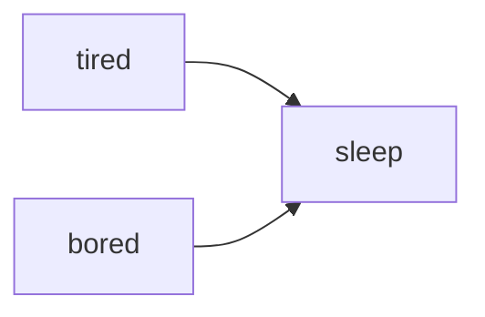

*I've been working on and thinking about counterfactual explanations for a few years now, so it is somewhat surprising that I haven't read Judea Pearl's "The Book of Why". I am remedying that...this is my book report.*

> God asked for the facts, and they replied with explanations.

Chapter 1 introduces two key concepts: the ladder of causation and causal graphs. 

<!--more-->

The ladder of causation is how Pearl describes ascending levels of understanding of the world, and how it relates to the kinds of questions that we can ask (and answer!) with diffierent models. 

1. At the lowest level is "seeing" or association: correlation, regression, ... prediction (that one hurts because it's true). At this level we're asking "What?"
   > Good predictions need not have good explanations.
2. The middle rung is "doing" or intervention: this level begins to consider confounders and holds things like randomized control trials. Already, this level requires a reasonable causal model, and deals with direction of causation. Here, we're asking "How?"
3. The highest level is "imagining" or counterfactuals, of course (she says in her most smug voice). This is where we find theories, robust models of the world -- this is where true understanding lies! I would give this level the question "What if?", but given the title of the book I think we'll go with "Why?"

In order to produce causal reasoning, in particular in machines, we need a language or a *representation* of causality and Pearl argues that this should be causal diagrams. 
Here's a causal diagram that accounts for my sleeping behaviors. 

There is a whole formal, mathematical description of causality which we'll surely get to in an upcoming chapter.
The arrows in these diagram have all sorts of probabilities attatched to them, though not, I think, the kind I'm used to. 
I'm already excited to learn more about the `do` operator. 
Still he argues (and I think it's a fair point) that the structure alone of these diagrams might be all you need to answer a large number of queries.

A fun piece in this chapter is the mini-Turing test, where a machine is asked to demonstrate causal reasoning. 
This book was originally published not so long ago in real time (2018), but an infinity of time ago in machine-learning-research time. 
Funny, then that this is still the mini-Turing tests that the LLMs of the 2020s are trying (and failing?) to pass. 
Funny, also, that if Pearl is to be believed (and if I understand him correctly at this point in my reading) they *fundamentatly* cannot pass this test; they are stuck at the lowest rung of the Ladder.
> If we want our computer to understand causation, we have to teach it how to break the rules.